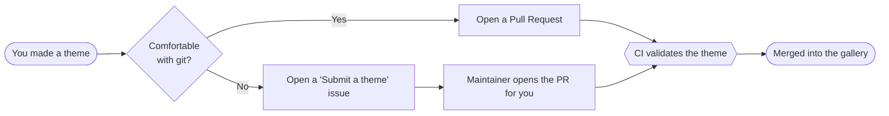

<p align="center">
  
</p>

<h1 align="center">Pelton Themes</h1>

<p align="center">
  The community gallery of themes for <a href="https://pelton.app">Pelton</a>, the privacy-first email client.<br>
  Browse, download, and share <code>.peltontheme</code> files — no account, no tracking.
</p>

<p align="center">
  <b>🖼️ Browse the gallery → <a href="https://themes.pelton.app">themes.pelton.app</a></b>
</p>

<p align="center">
  <a href="https://github.com/TRC-Loop/pelton-themes/issues/new?template=submit_theme.yml">
    
  </a>
  &nbsp;
  <a href="https://github.com/TRC-Loop/pelton-themes/issues/new?template=suggest_theme.yml">
    
  </a>
</p>

<p align="center">
  <a href="https://github.com/TRC-Loop/pelton-themes/blob/main/CONTRIBUTING.md">
    
  </a>
  <a href="https://docs.pelton.app/themes/">
    
  </a>
  <a href="https://arne.sh/discord">
    
  </a>
</p>

***

##  What is this?

A **theme** overrides Pelton's design tokens — every colour, font, radius and
shadow — plus optional CSS and interface icons. Anything a theme does not
override falls back to the built-in light or dark look, so a theme is always
complete.[^tokens]

Themes ship as single **`.peltontheme`** files (a zip container). This
repository collects them so you can find one, download it, and share your own.

[^tokens]: Full details, the complete token surface, and the security model are in the [theme documentation](https://docs.pelton.app/themes/).

##  Links

| | |
| --- | --- |
| 🌐 **Website** | <https://pelton.app> |
| 🖼️ **Theme gallery** | <https://themes.pelton.app> |
| 📖 **Documentation** | <https://docs.pelton.app> |
| 🎨 **Theme docs** | <https://docs.pelton.app/themes/> · [format spec](https://docs.pelton.app/themes/format/) · [create a theme](https://docs.pelton.app/themes/create/) |
| 💻 **Main app repo** | <https://github.com/TRC-Loop/Pelton> |
| 🖥️ **Website repo** | <https://github.com/TRC-Loop/pelton.app> |
| 🎭 **This repo** | <https://github.com/TRC-Loop/pelton-themes> |
| 💬 **Community** | <https://arne.sh/discord> |

##  Install a theme

1. Open a theme's folder under [`themes/`](themes/) and download its
   `.peltontheme` file.
2. In Pelton, go to **Settings → Themes → Import theme** and pick the file.
3. Review the metadata and raw CSS in the import preview, then click the
   theme's card to apply it.

> [!TIP]
> Sharing a theme with a friend is just sending them the `.peltontheme` file.

##  Gallery

Browse every theme with live previews and one-click download at
**[themes.pelton.app](https://themes.pelton.app)**, or see the full list in
**[GALLERY.md](GALLERY.md)** — both are generated automatically from the
themes in this repo.

> [!NOTE]
> Each theme's own `README.md` also carries a metadata table (version,
> compatibility, author and license) generated from its manifest.

##  Contribute a theme

We accept themes **two ways** — pick whichever suits you:



<details>
<summary><b>Quick start (pull request)</b></summary>

```sh
# 1. Fork, then copy the template
cp -r themes/_TEMPLATE themes/my-theme

# 2. Edit the source, then zip it into a .peltontheme
cd themes/my-theme/source
zip -r ../my-theme.peltontheme manifest.json tokens css assets

# 3. Add a LICENSE and README, then validate before pushing
cd ../../..
python3 scripts/validate_theme.py themes/my-theme
```

Then open a pull request. Full details are in
**[CONTRIBUTING.md](CONTRIBUTING.md)**.
</details>

### Requirements at a glance

- [x] A `.peltontheme` file in `themes/<your-theme>/`
- [x] A `LICENSE` in the folder
- [x] Passes `scripts/validate_theme.py` (run by CI)
- [x] `version` and `pelton.min` set in the manifest
- [ ] A preview screenshot _(recommended, not required)_
- [ ] A `README.md` describing the theme _(recommended)_

> [!IMPORTANT]
> Themes must **bundle** their fonts and images. A remote `url()` or `@import`
> can be used to track people, so CI rejects them — see the
> [security model](https://docs.pelton.app/themes/#security-model-in-short).

##  Licensing

Each theme is licensed by its own author under the `LICENSE` file in its
folder — check there before reusing one. The repository tooling and
documentation are maintained by the Pelton community.

***

<p align="center">
  <sub>Not affiliated with any brand whose palette a theme may reference. Built by the <a href="https://pelton.app">Pelton</a> community.</sub>
</p>
